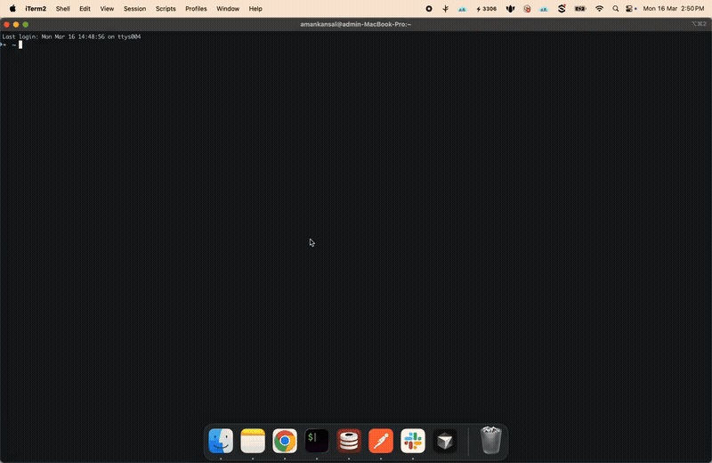
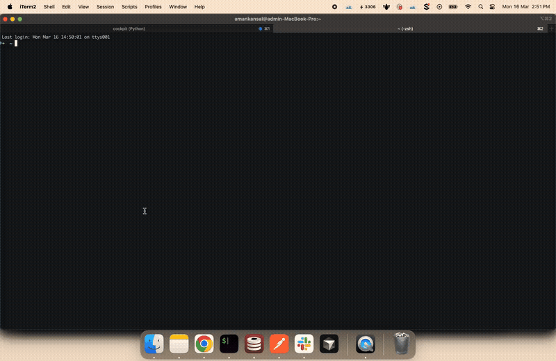

# Claude Cockpit

**X-ray vision for Claude Code.** A TUI dashboard that runs alongside your terminal, giving you live visibility into memory, tasks, conversations, context usage, plans, and stats — all without interrupting your workflow.

<p align="center">
  
  <br>
  <em>Claude Code on the left, Cockpit on the right — live sessions, tasks, context gauge, and deferred items at a glance</em>
</p>

## Install

### Claude Code Plugin (auto-memory hooks only)

```bash
/plugin install AmanKansal2012/claude-cockpit
```

This installs the auto-memory hooks that capture decisions, findings, and deferred items between sessions. No binary or Python needed — runs inside Claude Code's own agent system.

### Binary (recommended — full TUI dashboard, no Python needed)

**Homebrew:**
```bash
brew tap AmanKansal2012/claude-cockpit
brew install claude-cockpit
```

**Direct download (macOS arm64):**
```bash
curl -fsSL https://github.com/AmanKansal2012/claude-cockpit/releases/latest/download/cockpit-1.0.0-macos-arm64.zip -o cockpit.zip
unzip cockpit.zip && chmod +x cockpit && sudo mv cockpit /usr/local/bin/
```

### From source

```bash
git clone https://github.com/AmanKansal2012/claude-cockpit.git
cd claude-cockpit && ./install.sh
```

Then: `source ~/.zshrc` or open a new terminal.

```bash
cockpit              # full-screen dashboard
cockpit-toggle       # split pane next to Claude (iTerm2, source install only)
```

---

## Demo

<p align="center">
  
  <br>
  <em>Browse memory files, search, preview and edit — all with keyboard shortcuts</em>
</p>

<p align="center">
  
  <br>
  <em>Type <code>cockpit-toggle</code> to open Cockpit in a split pane next to your Claude session</em>
</p>

---

## Why

| Pain Point | How Cockpit Fixes It |
|---|---|
| **Context blowup** — Claude auto-compacts mid-task | Live context gauge shows real token usage |
| **Lost conversations** — messages vanish after compaction | Browse, search, pin, export full transcripts from JSONL |
| **No visibility** — memory, tasks, plans hidden behind `/commands` | All visible passively in a split pane |
| **Context loss across sessions** | Auto-memory hooks capture decisions and findings |
| **Multi-session blindness** | Live session dashboard with CPU, uptime, one-click navigation |
| **Stale tasks** | Task board with progress bars across all sessions |

---

## Features

### Context Gauge

Live context window usage in the top bar. Parses Claude's actual `autocompact` data — green/yellow/red thresholds, token count, cost estimate, session age.

### Session Dashboard

Live overview of every running Claude Code session — status (ACTIVE/idle), CPU%, uptime, child processes (MCP servers, agents), project, first prompt. Click or Enter to jump to that iTerm tab.

### Task Board

Tasks grouped by session with progress bars. Active (yellow), pending, blocked (`⊘`), completed (green), and deferred items extracted from auto-memory.

### Memory Explorer

Tree view of all memory files by project. Full-text search, inline editing with mtime-based conflict detection, auto-memory badge.

### Conversations Browser

Streams JSONL line-by-line (handles multi-GB files). Paginated, searchable, pin/export/rename sessions. Timeline view groups sessions and memory writes chronologically.

### Plans Viewer

Browse and edit plan files with markdown preview. Pin important plans.

### Auto-Memory

Automatic context preservation between sessions via Claude Code hooks. Extracts decisions, findings, deferred items, and patterns. Toggle with `a` — when off, hooks are removed entirely (zero overhead).

### Stats & History

Usage metrics (model breakdown, tokens, cost, sparklines), searchable command history.

---

## Keybindings

| Key | Action |
|-----|--------|
| `m` `t` `p` `c` `s` `h` | Switch tabs (Memory/Tasks/Plans/Conversations/Stats/History) |
| `←` `→` | Previous / next tab |
| `/` | Search |
| `r` | Refresh all |
| `a` | Toggle auto-memory |
| `?` | Help screen |
| `q` | Quit |
| `↓` `↑` `j` `k` | Navigate items (Tasks tab) |
| `Enter` | Open session in iTerm (Tasks tab) |
| `e` | Edit (Memory/Plans) |
| `Ctrl+S` | Save edit |
| `F2` | Rename (Conversations/Plans) |
| `f` | Pin/favorite (Conversations/Plans) |
| `x` | Export conversation as markdown |
| `t` | Timeline view (Conversations) |

---

## How It Works

Cockpit reads `~/.claude/` directly. No API calls, no session modifications. Auto-memory hooks use Claude Code's own agent system.

```
~/.claude/
├── projects/*/memory/*.md            → Memory tab
├── projects/*/memory/auto/*.md       → Auto-generated memory
├── projects/*/*.jsonl                → Conversations tab
├── tasks/*/N.json                    → Tasks tab
├── plans/*.md                        → Plans tab
├── stats-cache.json                  → Stats tab
├── history.jsonl                     → History tab
└── debug/*.txt                       → Context gauge
```

**Session detection:** `ps` → iTerm AppleScript → PID matching → JSONL mapping. **Context gauge:** Parses `autocompact: tokens=N threshold=N` from debug transcripts. **Auto-refresh:** `watchfiles` (Rust-based) watches `~/.claude/`.

---

## Development

```bash
.venv/bin/pytest tests/ -v    # 180 tests, <2s
.venv/bin/python -m cockpit   # run directly
```

Built with [Textual](https://textual.textualize.io/) and [Rich](https://rich.readthedocs.io/).

## License

MIT
